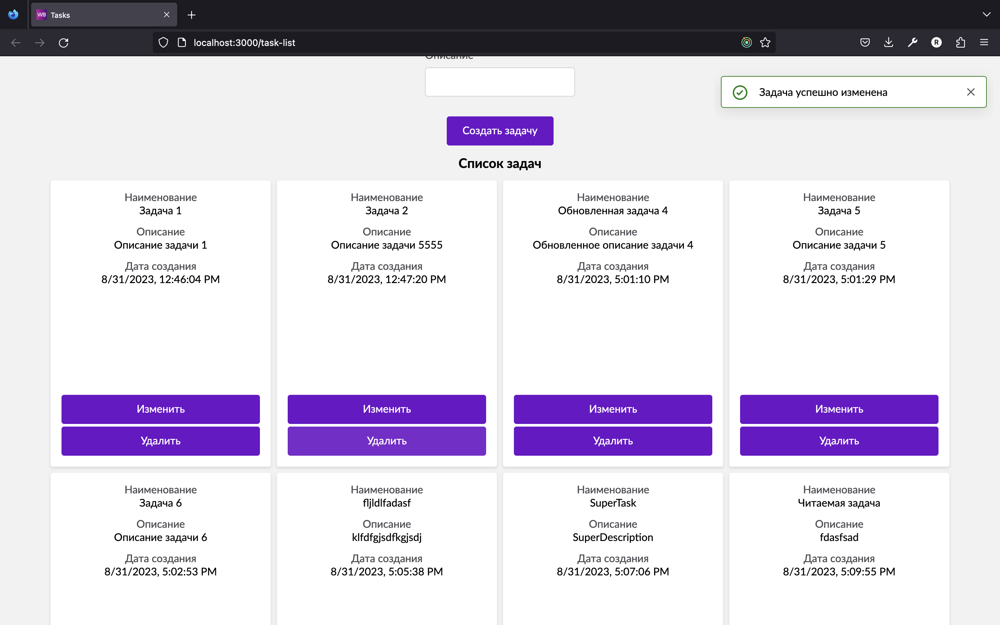

# WB Todo List

## Описание

Это простое приложение для управления списком задач (To-Do List),
сделанная на основе [Wildberries React Boilerplate](./docs/boilerplate.md)
разработанное с использованием наших библиотек.

## Функциональность

1. ***Локализация с i18next***
2. ***Управление задачами***
    - Создание новых задач.
    - Удаление задач.
    - Редактирование существующих задач.

3. ***Описание задачи***:
   #### Каждая задача включает в себя:
   - Наименование задачи.
   - Описание задачи.
   - Дату создания задачи.
   - Для управления задачами предоставлены кнопки "Сохранить", "Редактировать" и "Удалить".

4. ***Локальный мок-сервер***:

    Для работы с бекендом используется локальный мок-сервер. Это позволяет эмулировать серверное взаимодействие при
разработке.

5. ***Использование UI-Kit***:

   Используется UI-Kit компании для верстки компонентов. Это обеспечивает единообразный и стильный дизайн To-Do List.

## Как выглядит приложение:

### Создание задачи


### Изменение задачи


### Уведомления


### Смена языка


## Как начать

1) Клонируйте репозиторий на свой локальный компьютер

    ```shell
    git clone https://github.com/ruslan4432013/wb-todo.git
    cd wb-todo
    ```
   
2) Установите зависимости:

    ```shell
    npm install
    ```

3) Введите команду:

    ```shell
    npm run wb
    ```

4) Выберите команду `Открыть список дополнительных команд` -> `Запуск мок-сервера`
   Откроется мок-сервер `server/app.js` на порту `8081`

5) Запустить `npm run wb` и выбрать `Запуск клиентской части приложения`

#### Запустится локальный DEV-свервер по адресу: `http://localhost:3000`

## Основные команды

- `npm wb` - вызов CLI утилиты Boilerplate